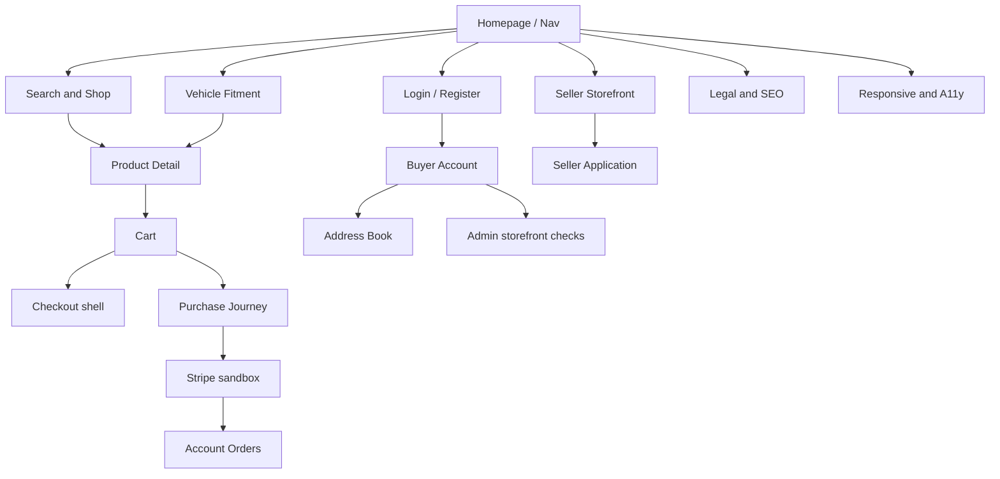
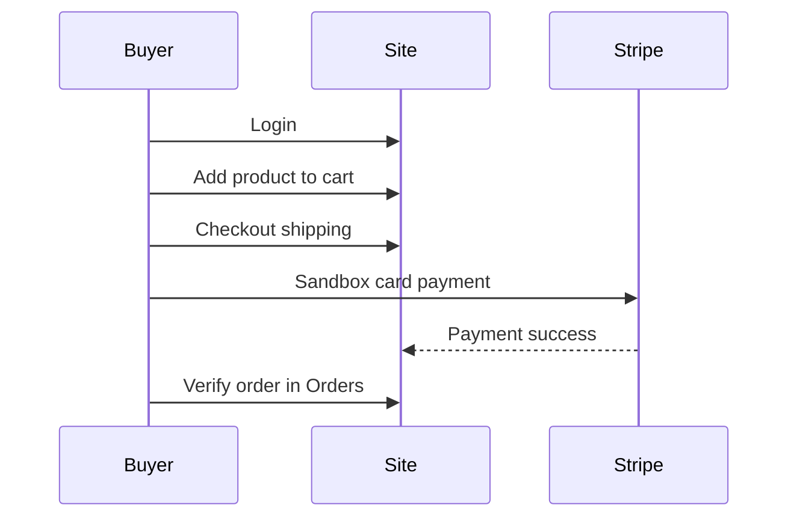

# OneDirectBuy Website Flows

> **HTML version:** open [ONEDIRECTBUY_FLOWS.html](ONEDIRECTBUY_FLOWS.html) in a browser for searchable, filterable documentation with diagrams.

Senior reference for every storefront flow covered by this automation suite. Use it to understand **what the website does**, **who acts**, and **how automation maps to each journey**.

| Item | Value |
|------|--------|
| Base URL | `https://onedirectbuy.com` (override with `ONEDIRECTBUY_BASE_URL`) |
| Flow catalog | [`flows.config.json`](../flows.config.json) |
| Step catalog | [`server/data/flow-steps.json`](../server/data/flow-steps.json) |
| Specs | [`tests/OneDirectBuy/`](../tests/OneDirectBuy/) |

---

## How to read this document

Each flow section follows the same template:

1. **Purpose** — business intent on the live site  
2. **Actors** — Guest, Buyer, Seller applicant, or Admin identity on the storefront  
3. **Entry points & routes** — URLs and chrome that start the journey  
4. **Happy path** — numbered product steps  
5. **Alternate / negative paths** — empty states, validation, 404s, bad credentials  
6. **Preconditions** — secrets / CI enablement when gated  
7. **Automation** — flow ID, specs, run command  

**Storefront vs portal:** Most flows below are public or buyer-facing on OneDirectBuy. Seller catalog inventory, bulk uploads, brand approval, and similar admin-portal work live in **OneChannel** and are tracked as skips — see [Out-of-scope / portal gaps](#out-of-scope--portal-gaps).

---

## Actors

| Actor | Description |
|-------|-------------|
| **Guest** | Unauthenticated shopper. Can browse, search, fit vehicles, add to cart, open checkout shell, apply as seller, read policies. |
| **Buyer** | Authenticated shopper (`ONEDIRECTBUY_BUYER_*`). Account dashboard, addresses, wishlist, orders, full Stripe purchase. |
| **Seller applicant** | Guest or logged-in user on Become a Vendor / seller application (storefront). Full seller workspace is not on this site. |
| **Admin (storefront identity)** | Uses admin/buyer credentials to reach account chrome and storefront management surfaces. Not a full OneChannel admin portal suite. |

---

## Flow index

| ID | Flow | Category | Auth | CI enabled |
|----|------|----------|------|------------|
| **1** | Guest Chrome (Homepage & Navigation) | Guest | No | Yes |
| **2** | Search & Shop Listing | Guest / Buyer | No | Yes |
| **3** | Vehicle Fitment | Guest / Buyer | No | Yes |
| **4** | Product Detail | Guest / Buyer | Optional (wishlist) | Yes |
| **5** | Cart | Guest / Buyer | No | Yes |
| **6** | Auth — Login & Registration (public) | Guest | Partial (login with secrets) | Yes |
| **6.1** | Buyer Authenticated Account | Buyer | Yes | No (gated) |
| **6.2** | Buyer Purchase Journey (Stripe) | Buyer | Yes + Stripe | No (gated) |
| **7** | Checkout | Guest / Buyer | No | Yes |
| **8** | Legal & SEO | Guest | No | Yes |
| **9** | Seller Storefront & Onboarding | Seller / Guest | Optional | Yes |
| **10** | Seller / Admin Backends (storefront + coverage) | Seller / Admin | Mixed | Yes |
| **10.1** | Admin Backend Login | Admin | Yes | No (gated) |
| **11** | Responsive UI & Accessibility | Cross-cutting | No | Yes |
| **12** | Buyer Address Book | Buyer | Yes | No (gated) |

Run a single flow locally:

```bash
# Example: Cart (flow 5)
npx cross-env CI_TESTS_CONFIG=flows.config.json node scripts/run-ci-tests.js flow:5
```

Toggle `enabled` in `flows.config.json` (local) or `ci-tests.config.json` (CI). Secrets guidance: [`docs/CI_SECRETS.md`](CI_SECRETS.md).

---

## End-to-end journey map



**Primary shopper path:** Homepage → Search / Fitment → PDP → Cart → (Login) → Checkout → Payment → Orders.

**Seller path (public):** Homepage → Sell on OneDirectBuy → Application → Fee / prohibited / terms policies → Store directory.

---

## Flow 1 — Guest Chrome (Homepage & Navigation)

### Purpose

Establish the marketplace shell: branding, hero, header shortcuts, department navigation, footer legal links, and mobile chrome so a guest can reach every major surface.

### Actors

Guest

### Entry points & routes

| Entry | Route / control |
|-------|-----------------|
| Homepage | `/` |
| Shop all | `/shop` |
| Sell | `/vendor/become-a-vendor` |
| Order tracking | `/account/order-tracking` |
| Privacy / Terms / Contact | `/info/privacy-policy`, `/info/terms-of-service`, `/info/contact-us` |
| Category example | `/category/exterior` |

### Happy path

1. Open homepage; title and H1 establish OneDirectBuy marketplace identity.  
2. Hero promotes **Find Parts That Fit Your Vehicle**.  
3. Confirm store benefits row, header search (category + box + Search), and account / wishlist / cart shortcuts.  
4. Open **Shop by Department**, expand categories, navigate to Exterior.  
5. Use header/footer: All products → `/shop`, Sell → vendor landing, Track order → order tracking.  
6. Open Privacy, Terms, Contact; Help Center opens in-page Conversations assistant.  
7. From `/shop`, logo returns home; breadcrumb Home works.  
8. On mobile, bottom bar exposes Menu / Categories / Vehicle / Search / Cart; Menu → Shop.

### Alternate / negative paths

- Cookie consent and assistant overlays may cover chrome; dismiss before interacting.  
- Upstream 502/503 retries are infra, not product defects.

### Preconditions

None (guest). Homepage should load within ~15s at full desktop width.

### Automation

| | |
|--|--|
| Flow ID | `1` |
| Specs | `Homepage.spec.js`, `Navigation.spec.js` |
| Helpers | `oneDirectBuyNav.js` |
| Key steps | ODB-UC-026*, 027–029, 038–040, 506 |

---

## Flow 2 — Search & Shop Listing

### Purpose

Let shoppers find products by keyword or category, refine with filters/sort/pagination, open a PDP, and add to cart from a listing card.

### Actors

Guest (same UI for Buyer)

### Entry points & routes

| Entry | Route |
|-------|--------|
| Header search | `/search?keyword=…` |
| Shop all | `/shop` |
| Category sidebar | e.g. Exterior under Categories |
| Product from results | `/product/{slug}` |

### Happy path

1. Type a keyword in **Search products**, submit Search → results heading.  
2. On `/shop`, confirm **Products found** count and product cards (link, price, image).  
3. Filter: By Price ($0–$20,000), By Brands, Availability (In stock), By Rating.  
4. Sort: price low→high / high→low, latest, popularity.  
5. Paginate with Previous / Next when available.  
6. Open first product from search or shop.  
7. **Add To Cart** from a product card when in stock.

### Alternate / negative paths

- Empty keyword → empty/validation messaging on search.  
- Misspelled keyword still loads the search results page (may be empty or fuzzy).  
- Re-opening `/shop` restores the full listing count after filters.

### Preconditions

None. Default ATC keyword often `filter` (`ONEDIRECTBUY_ATC_KEYWORD`).

### Automation

| | |
|--|--|
| Flow ID | `2` |
| Specs | `Search.spec.js`, `CategoryProductListing.spec.js` |
| Helpers | `searchProducts`, `waitForShopProducts`, `shopSortSelect` |
| Key steps | ODB-UC-030–037, 041–053, 507 |

---

## Flow 3 — Vehicle Fitment

### Purpose

Help auto-parts shoppers declare a vehicle (Year/Make/Model or VIN) so they can shop parts that fit; includes mobile Vehicle entry and SKU/OEM-style search.

### Actors

Guest / Buyer

### Entry points & routes

| Entry | Control / route |
|-------|-----------------|
| Homepage hero | Find Parts That Fit Your Vehicle |
| Select Vehicle | My Vehicles garage panel |
| Add Vehicle | Year / Make / Model + Find Parts |
| VIN | VIN tab → 17-char input + Look up VIN |
| Mobile | Bottom **Vehicle** → My Vehicles / Add |
| SKU search | Header search e.g. `60431` |

### Happy path

1. Homepage hero promotes fitment.  
2. **Select Vehicle** expands **My Vehicles**.  
3. **Add Vehicle** → Year / Make / Model; **Find Parts** enables after all three.  
4. Switch to VIN tab; enter 17 characters and use Look up VIN.  
5. Search by SKU/OEM keyword and land on results.  
6. On 390px viewport, open Vehicle from the bottom bar.

### Alternate / negative paths

- Incomplete YMM leaves Find Parts disabled.  
- Invalid VIN length should not proceed as a successful lookup (UI validation).

### Preconditions

None. Garage state may persist in browser storage across reloads.

### Automation

| | |
|--|--|
| Flow ID | `3` |
| Specs | `AutoPartsFitment.spec.js` |
| Helpers | `oneDirectBuyFitment.js` |
| Key steps | ODB-UC-091–094, 109–110 |

---

## Flow 4 — Product Detail (PDP)

### Purpose

Present a sellable SKU: media, identity (SKU/brand/stock/seller), purchase actions, policy links, tabs, and related products; handle missing product URLs cleanly.

### Actors

Guest; Buyer for authenticated wishlist path

### Entry points & routes

| Entry | Route |
|-------|--------|
| From shop/search | `/product/{slug}` |
| Bad / deleted slug | 404 “Ohh! Page not found” |
| Wishlist | `/account/wishlist` (auth) |
| Return policy | `/info/return-refund` (or linked copy) |

### Happy path

1. Open an in-stock product: H1 title + price.  
2. Gallery: main image or View larger.  
3. Confirm SKU#, Brand, stock, Ships from, **Sold by**.  
4. Adjust quantity; **Add to cart** → Cart Updated notice.  
5. **Buy Now** visible; wishlist control visible for guests.  
6. Open Description / Specification tabs; Related products links.  
7. Return & Refund policy link reachable.

### Alternate / negative paths

- Invalid or deleted product slug → not-found page.  
- Wishlist deep-link may require buyer credentials.  
- Stock mismatch (shown In stock but ATC fails) is a known journey hazard (see Flow 6.2).

### Preconditions

Guest for core PDP. `ONEDIRECTBUY_BUYER_*` for ODB-UC-064 wishlist reachability.

### Automation

| | |
|--|--|
| Flow ID | `4` |
| Specs | `ProductDetail.spec.js` |
| Helpers | `openFirstProductFromShop`, `openProductFromSearch` |
| Key steps | ODB-UC-056–075, 406, 508, 064 |

---

## Flow 5 — Cart

### Purpose

Maintain a shopping cart: add lines, change quantity, remove, persist across reload, merge after guest→register, show subtotal, proceed to checkout, apply coupons.

### Actors

Guest / Buyer

### Entry points & routes

| Entry | Route |
|-------|--------|
| Cart | `/account/shopping-cart` |
| From shop ATC | Product card → cart |
| Checkout CTA | → `/account/checkout` |

### Happy path

1. Add a product from shop; open cart and see line items.  
2. Increase quantity; confirm qty update.  
3. Reload; lines persist.  
4. Order summary shows Subtotal and **Proceed to checkout**.  
5. Optional: apply valid coupon from `ONEDIRECTBUY_TEST_COUPON`.

### Alternate / negative paths

- Empty cart: “Your cart is empty” + Continue shopping.  
- Remove last line → empty state.  
- Guest cart retained after registration path.  
- Invalid/expired coupon → error notice.

### Preconditions

None for core cart. Coupon tests need `ONEDIRECTBUY_TEST_COUPON`.

### Automation

| | |
|--|--|
| Flow ID | `5` |
| Specs | `Cart.spec.js` |
| Helpers | `waitForCartReady`, ATC helpers in `oneDirectBuyNav.js` |
| Run | `npm run test:cart` |
| Key steps | ODB-UC-112–118, 121, 124–125 |

---

## Flow 6 — Auth (Login & Buyer Account) — public

### Purpose

Expose sign-in and registration without requiring secrets for UI checks; optionally prove credential login when buyer secrets exist. Gate protected pages (orders) behind login for guests.

### Actors

Guest; Buyer when secrets set

### Entry points & routes

| Entry | Route |
|-------|--------|
| Login | `/account/login` |
| Register | `/account/register` |
| Protected sample | `/account/orders` → redirects to login for guest |
| Post-login | `/account/my-account` |

### Happy path

1. Open login: Welcome back, email/password, Sign in.  
2. Confirm **Forgot password?** link.  
3. Open register: Conditions of Use + Privacy Notice; Full name / email / passwords / Create.  
4. Create account with a unique email → land in account (when registration succeeds).  
5. With secrets: Sign in → `/account/my-account`.

### Alternate / negative paths

- Bad credentials → sign-in failed notice.  
- Duplicate email on register → already exists notice.  
- Guest hitting `/account/orders` → login, no order table.

### Preconditions

Public UI: none. Successful login/create: `ONEDIRECTBUY_BUYER_*` (or unique email for create).

### Automation

| | |
|--|--|
| Flow ID | `6` |
| Specs | `Login.spec.js`, `BuyerAccount.spec.js` |
| Helpers | `oneDirectBuyAuth.js` |
| Key steps | ODB-UC-015, 007, 005*, 006, 385, 001–003, 475 |

---

## Flow 6.1 — Buyer Authenticated Account

### Purpose

After login, verify account dashboard, profile, addresses entry, password/profile copy, and logout.

### Actors

Buyer

### Entry points & routes

| Entry | Route |
|-------|--------|
| Dashboard | `/account/my-account` |
| Profile | `/account/user-information` |
| Addresses | `/account/addresses` |
| Logout | Returns to login Welcome back |

### Happy path

1. Log in; dashboard shows account chrome + Logout.  
2. Open Account information.  
3. Open Your Addresses.  
4. Confirm password/profile copy on user-information.  
5. Logout → login screen.

### Alternate / negative paths

- Missing secrets → suite skipped.  
- Session expiry mid-flow → redirect to login.

### Preconditions

`ONEDIRECTBUY_BUYER_EMAIL`, `ONEDIRECTBUY_BUYER_PASSWORD`. Flow **disabled** in config until secrets are wired in CI.

### Automation

| | |
|--|--|
| Flow ID | `6.1` |
| Specs | `BuyerAccountAuthenticated.spec.js` |
| Enabled | `false` by default |
| Key steps | ODB-UC-005-auth, 009, 010, 014, 021 |

---

## Flow 6.2 — Buyer Purchase Journey (Stripe)

### Purpose

Single serial happy path from login through paid order: prove the revenue path works end-to-end with Stripe sandbox.

### Actors

Buyer

### Entry points & routes

| Step | Route |
|------|--------|
| Login / dashboard | `/account/my-account` |
| Search / shop → PDP | `/search?keyword=…` or `/shop` → `/product/…` |
| Cart | `/account/shopping-cart` |
| Checkout | `/account/checkout` |
| Success | `/account/payment-success` (or order-success / orders) |
| Orders | `/account/orders` |

### Happy path

1. Assert site reachable (infra gate).  
2. Buyer logs in and reaches account.  
3. Clear cart if needed; add in-stock product; cart shows line + checkout CTA.  
4. Proceed to checkout with non-zero total.  
5. Fill or select shipping address.  
6. Place order with Stripe test card → confirmation.  
7. Order appears under Account → Orders.



### Alternate / negative paths

- Site unreachable → journey aborted (`J01-0-blocked`); remaining steps not product bugs.  
- Product shows In stock but ATC reports out of stock (`J01-2b`).  
- Place order incomplete → order-history check skipped (`J01-6-skipped`).  
- Failed required soft step stops the rest of the journey (no cascade noise).

### Preconditions

| Variable | Role |
|----------|------|
| `ONEDIRECTBUY_BUYER_EMAIL` / `_PASSWORD` | Login |
| `ONEDIRECTBUY_STRIPE_TEST_CARD` | Default `4242424242424242` |
| `ONEDIRECTBUY_STRIPE_TEST_EXP` | e.g. `12 / 34` |
| `ONEDIRECTBUY_STRIPE_TEST_CVC` | e.g. `123` |
| `ONEDIRECTBUY_STRIPE_TEST_ZIP` | e.g. `34746` |
| `ONEDIRECTBUY_ATC_KEYWORD` | Product search seed |

Flow **disabled** by default. Timeout budget ~6 minutes.

### Automation

| | |
|--|--|
| Flow ID | `6.2` |
| Specs | `BuyerPurchaseJourney.spec.js` |
| Helpers | `buyerPurchaseJourney.js`, address + auth helpers |
| Key steps | J01-0 … J01-6 (+ blocked/skipped advisories) |

---

## Flow 7 — Checkout

### Purpose

Validate the checkout shell for guests: contact & shipping, required fields, order summary with lines, empty-cart checkout, and payment-success page reachability (without requiring a live paid order in this flow).

### Actors

Guest / Buyer

### Entry points & routes

| Entry | Route |
|-------|--------|
| Checkout | `/account/checkout` |
| Empty cart checkout | Same URL with no lines |
| Payment success | `/account/payment-success` |

### Happy path

1. With items in cart, open checkout: Information + Contact & Shipping.  
2. Required shipping fields + Save address CTA.  
3. Order panel shows line item and Total $.  
4. Open payment-success confirmation page (route-level check).

### Alternate / negative paths

- Empty cart: “No Product.” and Total $0.00.  
- Save address without Name keeps required Name focused / validation.  
- Full paid placement lives in Flow **6.2**, not here.

### Preconditions

None for shell checks. Line-item checkout assumes a prior ATC.

### Automation

| | |
|--|--|
| Flow ID | `7` |
| Specs | `Checkout.spec.js` |
| Helpers | `gotoCheckout` / cart→checkout in `oneDirectBuyNav.js` |
| Key steps | ODB-UC-128–133, 138, 143 |

---

## Flow 8 — Legal & SEO

### Purpose

Publish policy pages, policies hub, HTML sitemap, contact, copyright, product canonicals, XML sitemap health, and a usable 404 experience.

### Actors

Guest

### Entry points & routes

| Page | Route |
|------|--------|
| Privacy | `/info/privacy-policy` |
| Terms | `/info/terms-of-service` |
| Shipping | `/info/shipping-policy` |
| Return & Refund | `/info/return-refund` |
| Fee schedule | `/info/fee-schedule` |
| Fulfillment | `/info/fulfillment-terms` |
| Prohibited products | `/info/prohibited-restricted-products-policy` |
| Policies hub | `/info/policies` |
| HTML sitemap | `/info/sitemap` |
| Contact | `/info/contact-us` |
| XML sitemap | `/sitemap.xml` |
| 404 sample | `/this-page-does-not-exist-404-test` |

### Happy path

1. Open each `/info/*` policy; correct H1.  
2. Policies hub shows card links.  
3. HTML sitemap heading + link toward XML.  
4. Privacy page shows © year.  
5. Contact-us heading present.  
6. PDP canonical points at onedirectbuy.com.  
7. GET `/sitemap.xml` returns non-5xx.

### Alternate / negative paths

- Unknown route → “Ohh! Page not found” with Homepage link.

### Preconditions

None.

### Automation

| | |
|--|--|
| Flow ID | `8` |
| Specs | `LegalPages.spec.js`, `ErrorHandlingSeo.spec.js` |
| Key steps | ODB-UC-375–384 (legal set), 458, 460–461, 469, 510 |

---

## Flow 9 — Seller Storefront & Onboarding

### Purpose

Buyer-facing store directory and vendor acquisition: browse stores, open store detail / Sold by on PDP, Start Selling application, and seller-related policy pages.

### Actors

Guest; optional logged-in buyer for Sell + Store list chrome

### Entry points & routes

| Entry | Route |
|-------|--------|
| Stores directory | `/stores` (fallback from `/vendor/store-list`) |
| Store detail | `/store/{id}` |
| Become a vendor | `/vendor/become-a-vendor` |
| Application | `/vendor/seller-application` |
| Fee / prohibited / ToS | `/info/fee-schedule`, `/info/prohibited-restricted-products-policy`, `/info/terms-of-service` |

### Happy path

1. Open store list: Search vendor + Visit Store.  
2. Filter vendors by search.  
3. Open store detail: Contact Seller + products.  
4. On PDP, confirm **Sold by**.  
5. Sell landing: Start Selling Today → application form (contact + business fields).  
6. FAQ / Seller Requirements on landing.  
7. Fee schedule, prohibited products, terms load as seller agreement stand-ins.

### Alternate / negative paths

- `/vendor/store-list` may 404; automation falls back to `/stores`.  
- Full seller portal after approval is **not** on this storefront (see Flow 10 / portal gaps).

### Preconditions

None for public onboarding. Authenticated Sell chrome needs buyer secrets.

### Automation

| | |
|--|--|
| Flow ID | `9` |
| Specs | `SellerStorefront.spec.js`, `SellerOnboarding.spec.js` |
| Helpers | `oneDirectBuySeller.js` |
| Key steps | ODB-UC-200, 364, 201, 066, 047, 183–197, 379–381 |

---

## Flow 10 — Seller / Admin Backends (storefront + coverage)

### Purpose

Cover seller-adjacent **storefront** behaviors (messaging entry, order tracking, coupons, store search, buyer orders shell) and keep seller.csv use-case IDs referenced. Catalog/inventory backend cases are explicitly skipped pending OneChannel automation.

### Actors

Guest, Buyer, Admin identity (storefront only)

### Storefront surfaces (exercised)

| Area | Behavior | Routes |
|------|----------|--------|
| Messaging | Contact Seller → Conversations | `/store/…`, Conversations panel |
| Orders | Guest order tracking form | `/account/order-tracking` |
| Orders | Authenticated orders shell | `/account/orders` |
| Promotions | Coupon field + invalid code | `/account/shopping-cart` |
| Admin-ish browse | Store search, Sell vs buyer chrome | `/stores`, Sell landing, my-account |
| Coverage | seller.csv load + ID references | `SellerCsvCoverage.spec.js` |

### Happy path (storefront)

1. From store page, Contact Seller opens Conversations.  
2. Guest order tracking: Order ID + Track Your Order.  
3. Logged-in buyer: my-account and `/account/orders` shell.  
4. Cart coupon Apply; invalid coupon notice.  
5. Search vendor on `/stores`; Sell landing still reachable alongside buyer chrome.  
6. seller.csv loads ≥60 ODB-UC rows; every ID appears in a `Seller*.spec.js`.

### Alternate / negative paths / portal honesty

- Seller **reply** in portal, seller order notifications, approve/reject seller apps, and catalog/inventory/bulk ops are **skipped** — require OneChannel / seller portal.  
- See [Out-of-scope / portal gaps](#out-of-scope--portal-gaps) for the tracked backend-only ID list.

### Preconditions

Buyer secrets for authenticated order/messaging shells. Seller portal credentials not required for storefront slices.

### Automation

| | |
|--|--|
| Flow ID | `10` |
| Specs | `SellerMessaging`, `SellerOrders`, `SellerPromotions`, `SellerAdminManagement`, `SellerCatalogBackend`, `SellerCsvCoverage` |
| Helpers | `oneDirectBuySeller.js`, `sellerUseCases.js` |
| Key steps | ODB-UC-323*, 066-msg, 169, 167–180, 396*, 364–365, 476, csv coverage |

---

## Flow 10.1 — Admin Backend Login

### Purpose

With admin/buyer credentials, confirm storefront account access after login: dashboard, stores, search, orders, tracking, and Sell landing — **not** a full admin CMS suite.

### Actors

Admin (falls back to buyer credentials)

### Entry points & routes

| Entry | Route |
|-------|--------|
| Dashboard | `/account/my-account` |
| Stores | `/stores` |
| Orders | `/account/orders` |
| Tracking | `/account/order-tracking` |
| Sell | `/vendor/become-a-vendor` |

### Happy path

1. Log in; dashboard + Logout.  
2. Dashboard / Orders nav links.  
3. Store list visible; search for a keyword (e.g. bearing).  
4. Orders list or empty state; Order Tracking form.  
5. Sell on OneDirect Buy landing still reachable.

### Alternate / negative paths

- Missing secrets → skipped.  
- Does not automate OneChannel approve/reject seller workflows.

### Preconditions

`ONEDIRECTBUY_ADMIN_*` or buyer fallback. Flow **disabled** by default.

### Automation

| | |
|--|--|
| Flow ID | `10.1` |
| Specs | `AdminBackend.spec.js` |
| Key steps | ODB-UC-357–358, 364-admin, 365-admin, 371–374, 476-admin |

---

## Flow 11 — Responsive UI & Accessibility

### Purpose

Cross-cutting quality: mobile homepage/shop/PDP chrome, keyboard focus, image alt text, and labeled login validation.

### Actors

Guest

### Entry points & routes

Same primary routes as Flows 1–2, 4, 6 at viewport **390×844** and desktop.

### Happy path

1. Mobile: Welcome + bottom bar; Menu → Home / Shop / Vendor / Blogs.  
2. PDP H1 visible on mobile; shop shows Products found + links.  
3. Desktop: Tab focuses a visible control on homepage.  
4. First shop product image has `alt`.  
5. Login: Email / Password / Sign in labeled; empty Sign in shows Please input messages.

### Alternate / negative paths

- Assistant overlay can hide roles on mobile; dismiss before Menu/Vehicle assertions.

### Preconditions

None.

### Automation

| | |
|--|--|
| Flow ID | `11` |
| Specs | `ResponsiveAccessibility.spec.js` |
| Key steps | ODB-UC-491*, 492, 495, 499, 501–503 |

---

## Flow 12 — Buyer Address Book

### Purpose

Guests cannot manage addresses without login; authenticated buyers can add, edit, set default, and delete shipping addresses used at checkout.

### Actors

Guest (gate), Buyer (CRUD)

### Entry points & routes

| Entry | Route |
|-------|--------|
| Address book | `/account/addresses` |
| Add | `/account/addresses/add` |

### Happy path

1. Guest opens addresses or add → redirected to Welcome back login.  
2. Buyer opens add form: Name, Address line 1, Country, default checkbox.  
3. Save new address → list.  
4. Edit (e.g. city) → Save.  
5. Set default → Default badge.  
6. Delete address → line removed from list.

### Alternate / negative paths

- Missing secrets → authenticated describes skipped.  
- Validation on required shipping fields mirrors checkout (Name, etc.).

### Preconditions

`ONEDIRECTBUY_BUYER_*`. Flow **disabled** by default. Test address data: Kissimmee FL helper defaults in `oneDirectBuyAddress.js`.

### Automation

| | |
|--|--|
| Flow ID | `12` |
| Specs | `BuyerAddress.spec.js` |
| Helpers | `oneDirectBuyAddress.js` |
| Key steps | ODB-UC-010-guest*, 132-addr, 010–013 |

---

## Out-of-scope / portal gaps

These use cases are **tracked in automation as skips**. They require an authenticated **OneChannel Admin / seller portal**, not the public OneDirectBuy storefront:

| ID | Capability |
|----|------------|
| ODB-UC-077 | Variant-level inventory per seller |
| ODB-UC-081–083 | Price / sale price / negative price guards |
| ODB-UC-087–088 | UPC/GTIN/MPN + invalid UPC |
| ODB-UC-104, 106–107 | ACES / PIES upload + invalid PIES |
| ODB-UC-203–204 | Brand approval / new brand |
| ODB-UC-215, 219–221, 227–228 | Product create/review/images/specs/edit |
| ODB-UC-232–234, 242 | Bulk CSV / price / inventory + export |
| ODB-UC-248 | Required category attributes |
| ODB-UC-251–253 | Inventory qty add/reduce/negative guard |
| ODB-UC-293 | Approve buyer return |
| ODB-UC-317, 320 | Seller rating / respond to review |
| ODB-UC-330 | Seller approval notification |
| ODB-UC-509, 512 | Large bulk upload perf / recovery |

Also commonly skipped on storefront-only runs: seller portal messaging replies, seller order notification backends, admin approve/reject of seller applications.

When `ONEDIRECTBUY_SELLER_*` and portal routes exist, automate those in a separate project or extend Flow 10 — do not pretend they are OneDirectBuy.com pages.

---

## Quick reference — route map

| Area | Paths |
|------|--------|
| Home / browse | `/`, `/shop`, `/search?keyword=…`, `/category/{slug}`, `/product/{slug}` |
| Account / auth | `/account/login`, `/account/register`, `/account/my-account`, `/account/orders`, `/account/order-tracking`, `/account/shopping-cart`, `/account/checkout`, `/account/payment-success`, `/account/addresses`, `/account/addresses/add`, `/account/user-information`, `/account/wishlist` |
| Seller / vendor | `/vendor/become-a-vendor`, `/vendor/seller-application`, `/vendor/store-list` → `/stores`, `/store/{id}` |
| Legal / info | `/info/privacy-policy`, `/info/terms-of-service`, `/info/shipping-policy`, `/info/return-refund`, `/info/fee-schedule`, `/info/fulfillment-terms`, `/info/prohibited-restricted-products-policy`, `/info/policies`, `/info/sitemap`, `/info/contact-us` |
| SEO / errors | `/sitemap.xml`, intentional 404 paths |

---

## Quick reference — environment variables

| Variable | Used by |
|----------|---------|
| `ONEDIRECTBUY_BASE_URL` | All navigation |
| `ONEDIRECTBUY_BUYER_EMAIL` / `_PASSWORD` | Flows 6 (login), 6.1, 6.2, 10 (auth slices), 12, 10.1 fallback |
| `ONEDIRECTBUY_ADMIN_EMAIL` / `_PASSWORD` | Flow 10.1 |
| `ONEDIRECTBUY_SELLER_EMAIL` / `_PASSWORD` | Future seller portal (not storefront-critical today) |
| `ONEDIRECTBUY_ATC_KEYWORD` | Cart / purchase product seed (default `filter`) |
| `ONEDIRECTBUY_TEST_COUPON` | Cart / promotions coupon apply |
| `ONEDIRECTBUY_STRIPE_TEST_*` | Flow 6.2 place order |

Never commit `.env`. See [`CI_SECRETS.md`](CI_SECRETS.md) for GitHub Actions wiring.

---

## Related files

| File | Role |
|------|------|
| [`flows.config.json`](../flows.config.json) | Local flow enablement + test file lists |
| [`ci-tests.config.json`](../ci-tests.config.json) | CI file enablement + suite membership |
| [`scripts/run-ci-tests.js`](../scripts/run-ci-tests.js) | Runner (`flow:N`, smoke, regression, all) |
| [`scripts/extract-flow-steps.js`](../scripts/extract-flow-steps.js) | Regenerates `flow-steps.json` from soft-check IDs |
| [`docs/CI_SECRETS.md`](CI_SECRETS.md) | Secrets and gated specs |
