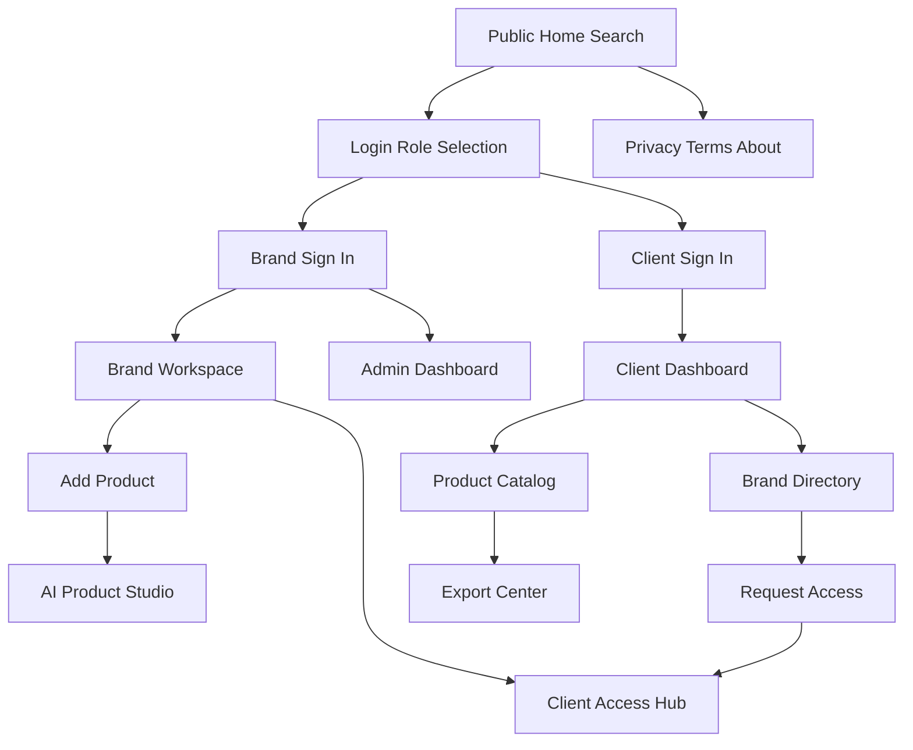
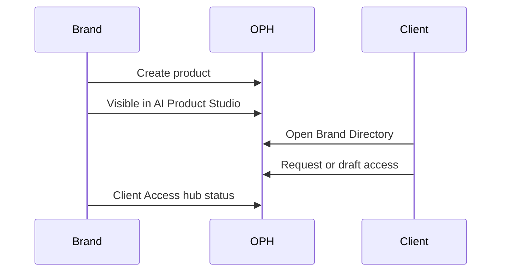

# One Product Hub — Website Flows

> **HTML version:** open [ONEPRODUCTHUB_FLOWS.html](ONEPRODUCTHUB_FLOWS.html) in a browser for searchable, filterable documentation with diagrams.

Senior reference for every storefront / portal flow covered by the **Testing-OneProductHubV2** automation suite against [oneproducthub.com](https://oneproducthub.com).

| Item | Value |
|------|--------|
| Base URL | `https://oneproducthub.com` (`ONEPRODUCTHUB_BASE_URL`) |
| API | `https://oneproducthub-backend.onechanneladmin.com` |
| Routing | SPA hash routes (`#/dashboard`, `#/products`, …) |
| Flow catalog | [`flows.config.json`](../flows.config.json) |
| Step catalog | [`server/data/flow-steps.json`](../server/data/flow-steps.json) |
| Specs | [`tests/OneproducthubV2/`](../tests/OneproducthubV2/) |

---

## Product overview

**One Product Hub (OPH)** is an AI product-data enrichment and sharing platform:

- **Guests** discover products on the public home (“Find Product Information”).
- **Brands** create and enrich catalog data, sync channels, manage client access, import/export.
- **Clients** browse approved brand catalogs, request access, export, and track changes.
- **Admins (Superadmin)** govern brands, clients, catalog, RBAC, and platform settings.

Login is **role-gated**: Continue as Brand vs Continue as Client. Superadmin signs in through the Brand portal and lands on **Admin Dashboard**.

---

## How to read this document

Each flow section:

1. **Purpose** — business intent
2. **Actors** — Guest / Brand / Client / Admin
3. **Entry points & routes** — URLs, sidebar labels, hash deep-links
4. **Happy path** — numbered product steps
5. **Alternate / negative paths**
6. **Preconditions** — credentials / env
7. **Automation** — flow ID, specs, soft-step IDs

Run a flow:

```bash
npm run test:flow          # all enabled flows
# or:
npx cross-env CI_TESTS_CONFIG=flows.config.json node scripts/run-ci-tests.js flow:1
```

---

## Actors

| Actor | Entry | Landing signal | Scope |
|-------|--------|----------------|--------|
| **Guest** | `https://oneproducthub.com` | Find Product Information, Log In / Start Free | Public search, policies, About |
| **Brand** | Login → Continue as Brand | Workspace Overview | Products, AI Studio, import/export, client access, data quality |
| **Client** | Login → Continue as Client | Welcome back | Brand directory, catalog, export, access drafts, team |
| **Admin** | Brand portal + superadmin creds | Admin Dashboard / Superadmin | Platform, registry, clients, RBAC, read-mostly studio |

---

## Flow index

| ID | Flow | Category | Auth | Steps (approx.) |
|----|------|----------|------|-----------------|
| **1** | Smoke Auth (Admin / Brand / Client login) | Auth | Yes | 3 |
| **2** | Auth & Access | Auth | Mixed | 11 |
| **3** | Public pages | Guest | No | 7 |
| **4** | Nav Matrices | All roles | Yes | 30 |
| **5** | Admin | Admin | Admin | 9 |
| **6** | Brand | Brand | Brand | 16 |
| **7** | Client | Client | Client | 12 |
| **8** | E2E Journeys | Cross-role | Brand + Client | 4 |

All flows are **enabled** in `flows.config.json` by default.

---

## End-to-end journey map



**Primary value path:** Guest discovers → Brand publishes product → Client requests access → Brand approves → Client browses/exports catalog.

---

## Flow 1 — Smoke Auth (Admin / Brand / Client login)

### Purpose

Prove each role can authenticate and land on the correct workspace shell.

### Actors

Admin, Brand, Client

### Entry points & routes

| Role | Path |
|------|------|
| All | Home → **Log In** / **Login** → role choice |
| Brand / Admin | Continue as Brand → Sign In |
| Client | Continue as Client → Sign In |

### Happy path

1. **Admin:** Sign in with superadmin → **Admin Dashboard**.
2. **Brand:** Sign in → **Workspace Overview**.
3. **Client:** Sign in → client dashboard (“Welcome back”).

### Alternate / negative paths

Covered in Flow 2 (invalid creds, wrong portal).

### Preconditions

| Env | Role |
|-----|------|
| `ONEPRODUCTHUB_ADMIN_EMAIL` / `_PASSWORD` | Admin |
| `ONEPRODUCTHUB_BRAND_EMAIL` / `_PASSWORD` | Brand |
| `ONEPRODUCTHUB_CLIENT_EMAIL` / `_PASSWORD` | Client |

### Automation

| | |
|--|--|
| Flow ID | `1` |
| Specs | `LoginAdmin.spec.js`, `LoginBrand.spec.js`, `LoginClient.spec.js` |
| Run | `npm run test:flow:smoke` or `flow:1` |
| Key steps | OPH-LOGIN-ADMIN-1, OPH-LOGIN-BRAND-1, OPH-LOGIN-CLIENT-1 |

---

## Flow 2 — Auth & Access

### Purpose

Harden identity: bad credentials, portal isolation, logout, session persistence, forgot password, signup forms, role selection, and guest guards on authenticated hashes.

### Actors

Guest, Brand, Client

### Entry points & routes

| Surface | Entry |
|---------|--------|
| Role selection | Login → Welcome to ProductHub |
| Brand / Client signup | Role → Create account |
| Forgot password | Brand login → Forgot password? |
| Protected hashes | `#/dashboard`, `#/products` as guest → public home |

### Happy path

1. Role selection shows Brand and Client choices.
2. Brand and Client signup forms expose required fields.
3. Forgot password UI opens from brand login.
4. Brand session survives full page reload.
5. Client Sign Out returns to public home.

### Alternate / negative paths

- Wrong password → error; stay on login.
- Brand credentials rejected on Client portal (and reverse).
- Guest opening `#/dashboard` or `#/products` sees public home (not app chrome).

### Preconditions

Valid Brand/Client creds for logout, session, wrong-portal tests.

### Automation

| | |
|--|--|
| Flow ID | `2` |
| Specs | `LoginInvalidCredentials`, `LoginWrongPortal`, `Logout`, `SessionPersistence`, `ForgotPassword`, `SignupBrand`, `SignupClient`, `RoleSelection`, `UnauthenticatedGuard` |
| Key steps | OPH-LOGIN-INVALID-1, OPH-LOGIN-WRONG-PORTAL-*, OPH-LOGOUT-1, OPH-SESSION-PERSIST-1, OPH-FORGOT-PASSWORD-1, OPH-SIGNUP-*, OPH-ROLE-SELECTION-1, OPH-UNAUTH-GUARD-* |

---

## Flow 3 — Public pages

### Purpose

Public marketing / discovery surface: home search and legal/about footer destinations.

### Actors

Guest

### Entry points & routes

| Surface | Entry |
|---------|--------|
| Home | `/` — heading **Find Product Information** |
| Search | Search products, brands, MPN, SKU… |
| Footer | Privacy Policy, Terms of Service, Legal & Policies, About |
| CTAs | Start Free, Book a Demo, Log In |

### Happy path

1. Open public home.
2. Run a catalog search from the public search control.
3. Open Privacy Policy, Terms of Service, Legal & Policies, About.

### Alternate / negative paths

- Empty or nonsense search still loads results shell (may be empty).

### Preconditions

None.

### Automation

| | |
|--|--|
| Flow ID | `3` |
| Specs | `PublicHomeSearch.spec.js`, `PublicPolicies.spec.js` |
| Key steps | OPH-PUBLIC-HOME-1, OPH-PUBLIC-SEARCH-1, OPH-PUBLIC-PRIVACY-1, OPH-PUBLIC-TERMS-1, OPH-PUBLIC-LEGAL-1, OPH-PUBLIC-ABOUT-1 |

---

## Flow 4 — Nav Matrices

### Purpose

Walk every primary sidebar destination for Admin, Brand, and Client; assert headings and role-specific absences (no fatal shell errors).

### Actors

Admin, Brand, Client

### Admin sidebar

Platform · Workspace · Brand Directory · Clients · Brand Registry · Product Catalog · AI Product Studio · Distributions · Export Center · Import Center · Product Change Log · RBAC Access · Settings

### Brand sidebar

Dashboard · AI Product Studio · Distributions · Client Access · Data Quality Dashboard · Export Center · Import Center · Product Change Log · Settings · Subscription

### Client sidebar

Dashboard · Brand Directory · Product Catalog · Export Center · Product Change Log · Settings · Subscription

**Client must not see:** Import Center, AI Product Studio (brand-only).

### Happy path

1. Sign in as each role.
2. Click each sidebar item; heading matches expected cue.
3. Confirm role-specific items absent where required.

### Alternate / negative paths

- Missing nav label or wrong heading → soft failure recorded.
- Digital Shelf not in Admin matrix (absent by design in suite).

### Preconditions

All three credential sets.

### Automation

| | |
|--|--|
| Flow ID | `4` |
| Specs | `NavMatrixAdmin.spec.js`, `NavMatrixBrand.spec.js`, `NavMatrixClient.spec.js` |
| Helpers | `clickSidebarNav`, `expectHeading`, `navigateToHash` |
| Key steps | OPH-NAV-ADMIN-*, OPH-NAV-BRAND-*, OPH-NAV-CLIENT-* |

---

## Flow 5 — Admin

### Purpose

Platform operator surfaces: oversee brands and clients, browse catalog, import/export centers, RBAC, settings; AI Studio is view-oriented (no brand-style Add Product).

### Actors

Admin (Superadmin)

### Entry points & routes

Sidebar labels from Flow 4 Admin matrix; landing **Admin Dashboard**.

### Happy path

1. Open Platform / Admin Dashboard overview.
2. Brand Registry with review controls (approve/deny cues).
3. Brand Directory — open and inspect a brand.
4. Clients management.
5. Product Catalog browse.
6. Import Center and Export Center.
7. AI Product Studio (admin; no add-product workflow).
8. RBAC Access.
9. Settings.

### Alternate / negative paths

- Admin AI Studio may surface Add Product UI but block with platform-admin messaging.

### Preconditions

`ONEPRODUCTHUB_ADMIN_*`

### Automation

| | |
|--|--|
| Flow ID | `5` |
| Specs | `AdminPlatformDashboard`, `AdminBrandRegistry`, `AdminBrandDirectoryDrilldown`, `AdminClientsManagement`, `AdminProductCatalog`, `AdminImportExport`, `AdminAIProductStudio`, `AdminRbac`, `AdminSettings` |
| Key steps | OPH-ADMIN-DASHBOARD, OPH-ADMIN-BRAND-REGISTRY, OPH-ADMIN-BRAND-DIRECTORY, OPH-ADMIN-CLIENTS, OPH-ADMIN-PRODUCT-CATALOG, OPH-ADMIN-IMPORT-EXPORT, OPH-ADMIN-AI-STUDIO, OPH-ADMIN-RBAC, OPH-ADMIN-SETTINGS |

---

## Flow 6 — Brand

### Purpose

Brand product workspace: create products, enrich in AI Studio, distribute, manage client access, data quality, import/export, changelog, settings, subscription.

### Actors

Brand

### Entry points & routes

| Surface | Entry |
|---------|--------|
| Dashboard | Workspace Overview |
| Add Product | Create New Product form |
| Studio | AI Product Studio |
| Access | Client Access hub |
| Settings profile | `#/settings?section=profile` |

### Happy path

1. Open Brand Dashboard (Workspace Overview).
2. **Add Product:** open form → fill name, SKU, price, brand, category, description, stock → Save → verify created.
3. Open product detail from Studio.
4. AI Product Studio with filters.
5. Distributions / channel sync.
6. Client Access hub (pending / approved / revoked).
7. Data Quality Dashboard.
8. Export Center and Import Center.
9. Product Change Log.
10. Settings (+ profile deep-link).
11. Subscription plans.

### Alternate / negative paths

- Category picker: select existing or **Create "{name}"**.
- Save validation if required fields empty.

### Preconditions

`ONEPRODUCTHUB_BRAND_*`

### Automation

| | |
|--|--|
| Flow ID | `6` |
| Specs | `BrandDashboard`, `BrandAddProduct`, `BrandProductDetail`, `BrandAIProductStudio`, `BrandDistribution`, `BrandClientAccess`, `BrandDataQuality`, `BrandExport`, `BrandImport`, `BrandProductChangelog`, `BrandSettings`, `BrandSubscription` |
| Key steps | OPH-BRAND-DASHBOARD, OPH-BRAND-ADD-*, OPH-BRAND-PRODUCT-DETAIL, OPH-BRAND-AI-STUDIO, OPH-BRAND-DISTRIBUTION, OPH-BRAND-CLIENT-ACCESS, OPH-BRAND-DATA-QUALITY, OPH-BRAND-EXPORT, OPH-BRAND-IMPORT, OPH-BRAND-CHANGELOG, OPH-BRAND-SETTINGS*, OPH-BRAND-SUBSCRIPTION |

---

## Flow 7 — Client

### Purpose

Client consumption: browse brands and catalog, manage access drafts and team, export, subscription — while blocked from brand-only tools (import, data quality, AI studio).

### Actors

Client

### Entry points & routes

| Surface | Route / nav |
|---------|-------------|
| Dashboard | Welcome back · Brands you can access |
| Brand Directory | Sidebar |
| Product Catalog | Sidebar |
| Access drafts | `#/client-access-drafts` |
| Team invite | `#/client-team` |
| Gated deep links | `#/import`, `#/data-quality` → blocked |

### Happy path

1. Client dashboard overview; navigate to Brand Directory.
2. Browse Brand Directory.
3. Open Product Catalog.
4. Product Change Log.
5. Access drafts.
6. Export Center.
7. Team invite.
8. Settings (no brand-only nav).
9. Subscription plans.

### Alternate / negative paths

- Deep-link Import Center → blocked.
- Deep-link Data Quality → blocked.
- Import / AI Product Studio absent from Client sidebar.

### Preconditions

`ONEPRODUCTHUB_CLIENT_*`

### Automation

| | |
|--|--|
| Flow ID | `7` |
| Specs | `ClientDashboard`, `ClientBrandDirectory`, `ClientProductCatalog`, `ClientProductChangelog`, `ClientAccessDrafts`, `ClientExport`, `ClientTeam`, `ClientSettings`, `ClientSubscription`, `ClientCannotAccessBrandOnly` |
| Key steps | OPH-CLIENT-DASHBOARD*, OPH-CLIENT-BRAND-DIRECTORY, OPH-CLIENT-PRODUCT-CATALOG, OPH-CLIENT-CHANGELOG, OPH-CLIENT-ACCESS-DRAFTS, OPH-CLIENT-EXPORT, OPH-CLIENT-TEAM, OPH-CLIENT-SETTINGS, OPH-CLIENT-SUBSCRIPTION, OPH-CLIENT-GATE-* |

---

## Flow 8 — E2E Journeys

### Purpose

Cross-feature journeys that prove the core marketplace loop: Brand creates product visible in Studio; Client and Brand see complementary access surfaces.

### Actors

Brand, Client (parallel contexts for access journey)

### Journey A — Brand product lifecycle

1. Sign in as Brand → Workspace Overview.
2. Add Product with unique name/SKU, price, brand, category, description, stock → Save.
3. Assert product visible.
4. Open AI Product Studio → same product/SKU visible.

### Journey B — Client ↔ Brand access

1. **Client context:** Sign in → Brand Directory → Request access / Edit draft controls when present.
2. **Brand context:** Sign in → Client Access hub → pending/approved/revoked language.



### Alternate / negative paths

- Create product failure stops studio verification (dependent soft steps).
- Access request controls may be absent if no brands available to request.

### Preconditions

Brand + Client credentials. API rewrite to production backend when frontend still points at `localhost:4000` (`ensureApiRewrite`).

### Automation

| | |
|--|--|
| Flow ID | `8` |
| Specs | `E2E_BrandProductLifecycle.spec.js`, `E2E_ClientBrandAccessFlow.spec.js` |
| Key steps | OPH-E2E-CREATE-PRODUCT, OPH-E2E-VERIFY-STUDIO, OPH-E2E-CLIENT-DIRECTORY, OPH-E2E-BRAND-CLIENT-ACCESS |

---

## Role capability matrix

| Capability | Guest | Brand | Client | Admin |
|------------|:-----:|:-----:|:------:|:-----:|
| Public search | ✓ | — | — | — |
| Legal / About | ✓ | — | — | — |
| Add / edit products | — | ✓ | — | — |
| AI Product Studio | — | ✓ | ✗ | View |
| Import Center | — | ✓ | ✗ | ✓ |
| Export Center | — | ✓ | ✓ | ✓ |
| Data Quality | — | ✓ | ✗ | — |
| Client Access hub | — | ✓ | — | — |
| Brand Directory | — | — | ✓ | ✓ |
| Access drafts / Team | — | — | ✓ | — |
| Brand Registry / RBAC | — | — | — | ✓ |
| Clients management | — | — | — | ✓ |

---

## Quick reference — hash routes

| Hash | Typical user |
|------|----------------|
| `#/dashboard` | Authenticated home (role-specific) |
| `#/products` | Product surfaces / studio context |
| `#/import` | Brand / Admin (Client gated) |
| `#/data-quality` | Brand (Client gated) |
| `#/settings?section=profile` | Brand settings profile |
| `#/client-access-drafts` | Client |
| `#/client-team` | Client |

Most navigation is **sidebar label-driven**, not deep-link driven.

---

## Quick reference — environment variables

| Variable | Used by |
|----------|---------|
| `ONEPRODUCTHUB_BASE_URL` | All navigation (default `https://oneproducthub.com`) |
| `ONEPRODUCTHUB_API_BASE_URL` | API rewrite target |
| `ONEPRODUCTHUB_ADMIN_EMAIL` / `_PASSWORD` | Flows 1, 4, 5 |
| `ONEPRODUCTHUB_BRAND_EMAIL` / `_PASSWORD` | Flows 1, 2, 4, 6, 8 |
| `ONEPRODUCTHUB_CLIENT_EMAIL` / `_PASSWORD` | Flows 1, 2, 4, 7, 8 |

Never commit `.env`.

---

## Related files

| File | Role |
|------|------|
| [`flows.config.json`](../flows.config.json) | Flow enablement + test lists |
| [`scripts/run-ci-tests.js`](../scripts/run-ci-tests.js) | Flow runner |
| [`scripts/extract-flow-steps.js`](../scripts/extract-flow-steps.js) | Rebuilds `flow-steps.json` from `soft()` markers |
| [`tests/helpers/oneProductHubV2Auth.js`](../tests/helpers/oneProductHubV2Auth.js) | Login, roles, API rewrite |
| [`tests/helpers/oneProductHubV2Nav.js`](../tests/helpers/oneProductHubV2Nav.js) | Hash nav, sidebar, sign-out |
| [`docs/ONEPRODUCTHUB_FLOWS.html`](ONEPRODUCTHUB_FLOWS.html) | Interactive HTML twin |
